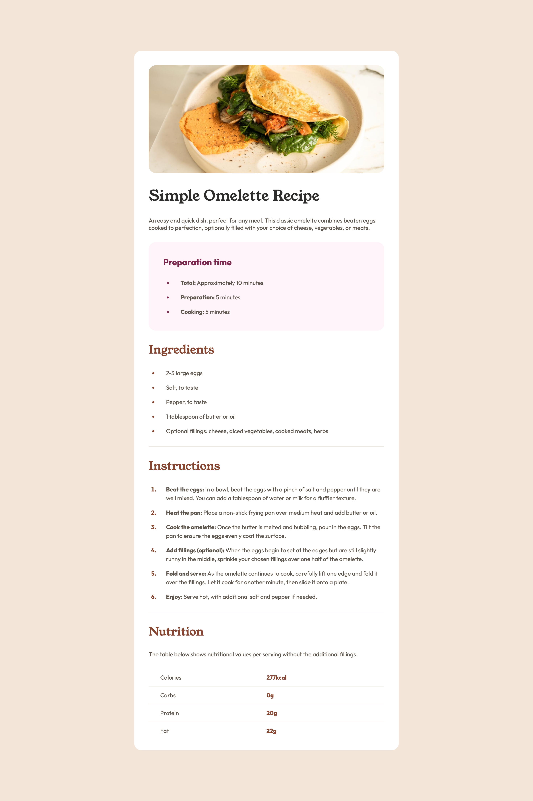

# Frontend Mentor - Recipe page solution

This is a solution to the [Recipe page challenge on Frontend Mentor](https://www.frontendmentor.io/challenges/recipe-page-KiTsR8QQKm). Frontend Mentor challenges help you improve your coding skills by building realistic projects. 

## Table of contents

- [Overview](#overview)
  - [Screenshot](#screenshot)
  - [Links](#links)
- [Built with](#built-with)
- [Author](#author)

## Overview

### Screenshot



### Links

- Live Site URL: [GitHub Pages link](https://samhlking.github.io/recipe-page-main/)

## Built with

- HTML5
- CSS
- Flexbox

I did not use any other tools or frameworks. I forgot about mobile-responsiveness until the end, so the code gets a bit messy with the ```@media``` tag and overall I'm sure it could be a lot cleaner code, but I don't thing it's too bad.

## Author

- Website - https://samuel-king.com/
- Frontend Mentor - https://www.frontendmentor.io/profile/samhlking